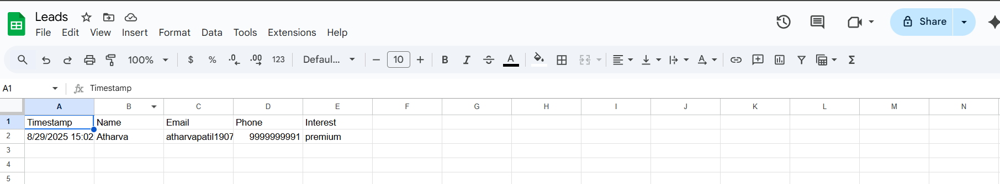

# 🦈 FitnessShark - Gym Landing Page

A modern, responsive, and aesthetic **landing page** for a gym called **FitnessShark**.  
Built with **React**, **Tailwind CSS**, and **React Scroll**, the project focuses on smooth user experience, clean design, and mobile responsiveness.  
**Value-added feature:** Captures leads from visitors and stores them in **Google Sheets** for easy follow-up and business growth.

---

## 🚀 Features

- ⚡ **Fast and Responsive** – Optimized for all devices (desktop, tablet, mobile)  
- 🎨 **Tailwind Styling** – Utility-first CSS for quick and modern design  
- 🖱️ **Smooth Scroll** – Section navigation powered by `react-scroll`  
- 🖼️ **Hero Section** – Highlighting brand identity  
- 📋 **Services Section** – Display gym offerings (Zumba, Personal Training, etc.)  
- ⭐ **Reviews Section** – Showcase client testimonials and experiences  
- 📞 **Contact Section** – Collect leads through a “7 Day Free Trial” form  

---

## 💡 Lead Capture and Google Sheets Integration

**How the website adds value to the business:**

1. **Lead Collection via Form**  
   - Visitors can submit their **Name, Email, Phone, and Membership Interest**.  
   - Encourages **potential customers to engage** directly with the gym.  

2. **Serverless API for Reliable Data Handling**  
   - Form data is sent to a **Vercel serverless function** (`/api/submitLead`).  
   - The serverless function forwards the data to **Google Sheets**.  

3. **Data Storage in Google Sheets**  
   - Leads are automatically saved in a sheet called **“Leads”** with the following columns:  

     | Timestamp | Name | Email | Phone | Interest |
     |-----------|------|-------|-------|----------|

   - Provides a **centralized record** of all inquiries for follow-up.  

4. **Business Value**  
   - Converts website visitors into **actionable leads**.  
   - Helps track **interested members** and measure marketing effectiveness.  

**Screenshot of leads in Google Sheets:**  

  

---
## Here's the link to FitnessShark

https://fitness-shark-gym.vercel.app/

## 🛠️ Tech Stack

- [React](https://reactjs.org/) – Component-based UI library  
- [Tailwind CSS](https://tailwindcss.com/) – Modern utility-first CSS framework  
- [React Scroll](https://www.npmjs.com/package/react-scroll) – Smooth scrolling navigation  
- [Lucide Icons](https://lucide.dev/) – Clean and modern icons  
- [Vercel Functions](https://vercel.com/docs/concepts/functions/serverless-functions) – Serverless API for lead handling  
- [Google Apps Script](https://developers.google.com/apps-script) – Storing leads in Google Sheets  

---

## 📂 Project Structure

```bash
fitnessshark/
│── public/                  # Static assets
│── src/
│   ├── components/          # Reusable UI components
│   ├── sections/            # Landing page sections (Hero, Services, Reviews, Contact)
│   ├── api/                 # Serverless function for handling leads
│   ├── App.jsx              # Root component
│   ├── main.jsx             # Entry point
│   └── index.css            # Global styles (Tailwind)
│── package.json             # Project dependencies
│── README.md               # Documentation
